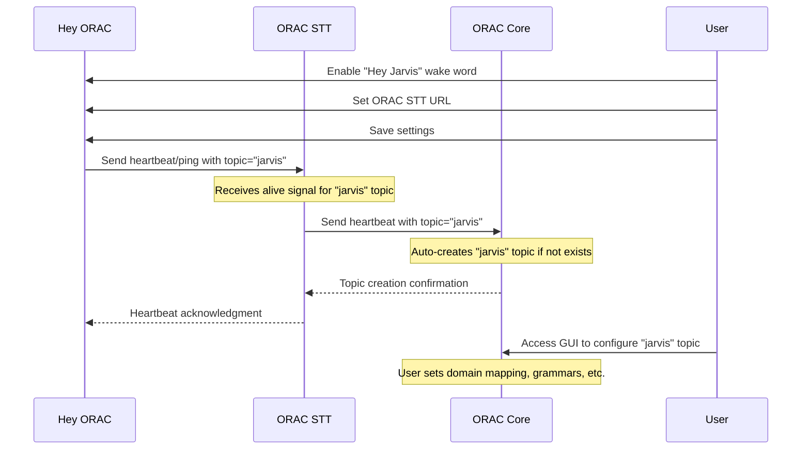

# ORAC Integration Flow: Wake Word to Topic Creation

## Overview

This document describes the complete integration flow from wake word detection through speech-to-text to topic management in the ORAC ecosystem. The system enables automatic topic discovery and configuration through a chain of heartbeat/ping signals.

## Architecture Components

```
Hey ORAC (Wake Word) → ORAC STT (Speech-to-Text) → ORAC Core (LLM & Topics)
```

### Component Responsibilities

1. **Hey ORAC**: Wake word detection and initial audio capture
2. **ORAC STT**: Speech transcription and topic routing
3. **ORAC Core**: LLM processing and topic management

## Integration Flow

### 1. Initial Configuration

#### Hey ORAC Configuration
- User enables a new wake word (e.g., "Hey Jarvis")
- User configures ORAC STT target URL in wake word settings
- Settings format: `http://192.168.8.191:7272/stt/v1/stream`

#### ORAC STT Configuration  
- User configures ORAC Core target URL via admin interface (ⓘ button)
- Settings format: `http://192.168.8.191:8000`
- Configuration persists in ORAC STT settings

### 2. Topic Discovery & Creation Flow



### 3. Operational Flow

#### Wake Word Detection
1. Hey ORAC detects configured wake word (e.g., "Hey Jarvis")
2. Captures subsequent audio stream
3. Sends audio to ORAC STT with topic metadata

#### Speech Processing
1. ORAC STT receives audio with topic information
2. Transcribes audio using Whisper models
3. Forwards transcription to ORAC Core with preserved topic

#### LLM Processing
1. ORAC Core receives transcription with topic
2. Routes to appropriate topic configuration
3. Processes using topic-specific settings (domain, grammar, etc.)
4. Returns response

### 4. Heartbeat & Health Check System

#### Purpose
- Maintain awareness of active wake word services
- Enable automatic topic discovery
- Provide health monitoring across the chain
- Batch processing for efficiency

#### Implementation

##### Heartbeat Timing Strategy
```python
# Activity-based intervals
base_interval = 30   # seconds when recently active
idle_interval = 60   # seconds when idle (no triggers for 5+ minutes)

# Jitter only needed for multiple Hey ORAC instances
jitter = random.randint(0, 10) if multiple_instances else 0

# Determine current interval based on activity
if any_model_triggered_recently:  # within last 5 minutes
    interval = base_interval + jitter
else:
    interval = idle_interval + jitter
```

##### Hey ORAC → ORAC STT Heartbeat (Batched)
```json
POST /stt/v1/heartbeat
{
  "source": "hey_orac",
  "instance_id": "hey_orac_001",
  "timestamp": "2025-08-29T10:00:00Z",
  "models": [
    {
      "topic": "jarvis",
      "wake_word": "Hey Jarvis",
      "status": "active",
      "last_triggered": "2025-08-29T09:55:00Z",
      "trigger_count": 42
    },
    {
      "topic": "friday",
      "wake_word": "Hey Friday",
      "status": "active", 
      "last_triggered": "2025-08-29T09:45:00Z",
      "trigger_count": 15
    },
    {
      "topic": "cortana",
      "wake_word": "Hey Cortana",
      "status": "inactive",  # Model disabled
      "last_triggered": null,
      "trigger_count": 0
    }
  ]
}
```

##### ORAC STT → ORAC Core Heartbeat (Batched Forward)
```json
POST /v1/topics/heartbeat
{
  "source": "orac_stt",
  "upstream_source": "hey_orac",
  "instance_id": "orac_stt_001",
  "timestamp": "2025-08-29T10:00:01Z",
  "topics": [
    {
      "name": "jarvis",
      "status": "active",
      "last_triggered": "2025-08-29T09:55:00Z",
      "trigger_count": 42,
      "wake_word": "Hey Jarvis"
    },
    {
      "name": "friday",
      "status": "active",
      "last_triggered": "2025-08-29T09:45:00Z",
      "trigger_count": 15,
      "wake_word": "Hey Friday"
    }
  ]
}
```

Note: Inactive models are filtered out by ORAC STT before forwarding to ORAC Core.

### 5. Configuration Interfaces

#### Hey ORAC Settings
- Wake word enable/disable
- ORAC STT target URL configuration
- Topic assignment per wake word
- Test connection functionality

#### ORAC STT Admin Interface (ⓘ Settings)
- **Current**: Shows ORAC STT webhook URL for Hey ORAC configuration
- **New**: Add ORAC Core target URL configuration
- **New**: Connection test and health check
- **New**: Active topics and their upstream sources

#### ORAC Core Web Interface
- Automatic topic creation from heartbeats
- Topic configuration (domain mapping, grammars)
- Source tracking and health status
- Manual topic management

### 6. Error Handling & Fallbacks

#### Connection Failures
- Hey ORAC falls back to local processing if ORAC STT unavailable
- ORAC STT queues transcriptions if ORAC Core unavailable
- Health indicators in all interfaces show connection status

#### Topic Discovery Failures
- ORAC Core creates topics with default settings
- User notification of new topics requiring configuration
- Graceful degradation to general topic if specific topic fails

### 7. Benefits

#### Automatic Topic Management
- Topics auto-created when wake words are enabled
- Reduces manual configuration overhead
- Maintains topic-source relationships

#### Health Monitoring
- Real-time status across the entire chain
- Connection health indicators in all interfaces
- Automated recovery and retry mechanisms

#### Flexible Configuration
- Per-wake-word topic assignment
- Dynamic ORAC Core target configuration
- Easy setup and testing workflow

### 8. Implementation Status & Next Steps

#### ✅ Phase 1: COMPLETED (2025-08-28)
**ORAC STT Admin Interface Update**
- ✅ Added ORAC Core configuration API endpoints (`GET/POST /admin/config/orac-core`)
- ✅ Updated settings popup (ⓘ button) with dual configuration:
  - ORAC STT webhook URL display for Hey ORAC configuration
  - ORAC Core target URL configuration with Test/Save functionality
- ✅ Modified ORACCoreClient to use configurable URL from settings
- ✅ Added real-time connection testing and validation
- ✅ Deployed to Orin Nano and verified functionality

#### ✅ Phase 2A: COMPLETED (2025-08-29)
**ORAC STT Heartbeat Receiver Implementation**
- ✅ Created heartbeat models for batched wake word tracking (`src/orac_stt/models/heartbeat.py`)
- ✅ Implemented heartbeat manager with TTL-based tracking (`src/orac_stt/core/heartbeat_manager.py`)
- ✅ Added `POST /stt/v1/heartbeat` endpoint to receive Hey ORAC heartbeats
- ✅ Added `GET /stt/v1/heartbeat/status` endpoint for monitoring
- ✅ Implemented filtering of inactive models before forwarding
- ✅ Added heartbeat forwarding to ORAC Core (ready when Core endpoint exists)
- ✅ Created test script for heartbeat functionality
- ✅ Deployed and verified on Orin Nano

**Important Deployment Note:**
- ⚠️ Fixed `deploy_and_test.sh` script to use current Git branch instead of hardcoded master
- The deployment script now correctly handles feature branches

#### 🔄 Phase 2B: IN PROGRESS
**Topic Management Architecture Changes**

**New Requirements Identified:**
- [ ] **Per-Topic ORAC Core URLs**: Each topic may need its own ORAC Core URL configuration
  - Topics could route to different ORAC Core instances
  - Enables distributed processing and load balancing
  - Allows specialized Core instances for different domains
  
- [ ] **ORAC STT Topic Registry**: ORAC STT needs its own topic list/registry
  - Mirror of ORAC Core's topic structure
  - Store per-topic configuration (Core URL, timeout, retry policy)
  - Enable topic-specific routing decisions
  - GUI for managing topic-to-Core mappings

**ORAC STT Tasks:**
- [ ] Create topic registry/database in ORAC STT
- [ ] Add per-topic ORAC Core URL configuration
- [ ] Update admin interface to manage topic configurations
- [ ] Modify heartbeat forwarding to use per-topic Core URLs
- [ ] Add topic synchronization with ORAC Core

**ORAC Core Tasks:**
- [ ] Add `POST /v1/topics/heartbeat` endpoint (batched)
- [ ] Auto-create topics from heartbeat if they don't exist
- [ ] Track source health and last activity timestamps
- [ ] Display source status in topic management interface
- [ ] Support topic metadata from heartbeats

#### 📋 Phase 3: PENDING
**Hey ORAC Integration**
- [ ] Add ORAC STT URL configuration per wake word
- [ ] Send batched heartbeats when wake words are enabled/saved
- [ ] Include all enabled models in single heartbeat payload
- [ ] Add connection test functionality in settings
- [ ] Implement activity-based heartbeat intervals (30s active, 60s idle)

#### 📋 Phase 4: PENDING
**Enhanced Health Monitoring & Multi-Instance Support**
- [ ] Add health status indicators across all interfaces
- [ ] Implement connection retry logic with exponential backoff
- [ ] Add metrics for heartbeat success/failure rates
- [ ] Create unified health dashboard showing entire chain status
- [ ] Support multiple ORAC Core instances with topic-based routing
- [ ] Add load balancing for distributed Core instances

### 9. Next Implementation Steps

#### ✅ Completed: Phase 2A - ORAC STT Heartbeat Receiver
All Phase 2A tasks have been completed and deployed to Orin Nano.

#### Immediate Next Steps (Phase 2B - Topic Registry & Per-Topic Routing)

1. **Create Topic Registry in ORAC STT** (`src/orac_stt/core/topic_registry.py`)
   ```python
   from pydantic import BaseModel
   from typing import Optional, Dict, Any
   
   class TopicConfig(BaseModel):
       name: str  # Topic identifier
       orac_core_url: str  # Core instance URL for this topic
       timeout: int = 30  # Request timeout
       retry_policy: Dict[str, Any]  # Retry configuration
       metadata: Dict[str, Any]  # Additional topic metadata
   
   class TopicRegistry:
       def __init__(self):
           self.topics: Dict[str, TopicConfig] = {}
       
       def register_topic(self, config: TopicConfig):
           """Register or update a topic configuration"""
       
       def get_core_url(self, topic: str) -> Optional[str]:
           """Get ORAC Core URL for a specific topic"""
       
       def sync_with_core(self, core_url: str):
           """Synchronize topic list with ORAC Core"""
   ```

2. **Update Admin Interface** (`src/orac_stt/web/`)
   - Add topic management page similar to ORAC Core
   - GUI for configuring per-topic ORAC Core URLs
   - Visual indicators for topic health/status
   - Batch operations for topic configuration

3. **Modify Forwarding Logic** (`src/orac_stt/core/heartbeat_manager.py`)
   - Use topic registry to determine target Core URL
   - Group heartbeats by target Core instance
   - Forward to multiple Core instances if needed
   - Handle per-topic routing failures gracefully

#### Next Steps (Phase 2C - ORAC Core Topic Auto-Creation)

1. **Add Batched Topic Heartbeat Endpoint** (`orac/api.py`)
   ```python
   @app.post("/v1/topics/heartbeat")
   async def receive_topic_heartbeat(request: CoreHeartbeatRequest):
       for topic in request.topics:
           # Auto-create topic if it doesn't exist
           if not topic_manager.topic_exists(topic.name):
               topic_manager.create_topic(
                   name=topic.name,
                   wake_word=topic.wake_word,
                   source="auto_heartbeat"
               )
           # Update topic metadata
           topic_manager.update_heartbeat(
               topic_name=topic.name,
               last_triggered=topic.last_triggered,
               trigger_count=topic.trigger_count,
               source=request.upstream_source
           )
       return {"status": "ok", "topics_processed": len(request.topics)}
   ```

2. **Extend Topic Manager** (`orac/topic_manager.py`)
   - Batch process multiple topics in single operation
   - Track heartbeat metadata per topic
   - Implement stale topic detection (no heartbeat > 120s)
   - Provide aggregated health status

3. **Update Topic UI** (`orac/templates/index.html`)
   - Show source status indicators with activity-based colors
   - Display last trigger time and count
   - Visual alert for stale topics (red indicator)
   - Batch refresh for multiple topic updates

### 10. Configuration Example

#### Complete Setup Scenario (Batched)

1. User enables multiple wake words in Hey ORAC:
   - "Hey Jarvis" → topic="jarvis"
   - "Hey Friday" → topic="friday"
   - "Hey Cortana" → topic="cortana"
2. User sets ORAC STT URL: `http://192.168.8.191:7272/stt/v1/stream`
3. User saves settings → Hey ORAC starts sending batched heartbeats every 30-60s
4. ORAC STT receives batch with all 3 models, forwards active ones to ORAC Core
5. ORAC Core receives batch, auto-creates all 3 topics with default settings
6. User accesses ORAC Core GUI:
   - Sees all 3 new topics with activity indicators
   - Configures domain mappings for each
   - Monitors trigger counts and last activity
7. System ready: Any wake word → transcription → correct topic processing → response

#### Activity-Based Behavior

- **Active Period** (recent triggers):
  - Heartbeat every 30 seconds
  - Green status indicators in UI
  - Quick topic discovery for new models
  
- **Idle Period** (no triggers > 5 minutes):
  - Heartbeat every 60 seconds
  - Yellow status indicators in UI
  - Lower network overhead
  
- **Stale Detection** (no heartbeat > 120 seconds):
  - Red status indicators in UI
  - Topic marked as potentially offline
  - Alert in admin interfaces

This batched flow reduces network traffic while providing comprehensive monitoring and automatic topic management across the ORAC ecosystem.

### 11. Technical Implementation Notes

#### Data Persistence
- **ORAC STT**: Heartbeats stored in memory with TTL (no persistence needed)
- **ORAC Core**: Topics persisted in `data/topics.yaml`
- **Hey ORAC**: Wake word configs in `config/settings.json`

#### Error Recovery
- Heartbeat failures don't block audio processing
- Missing topics default to "general" 
- Connection failures logged but processing continues
- Automatic retry with exponential backoff

#### Performance Considerations
- Active heartbeat interval: 30 seconds (recent activity)
- Idle heartbeat interval: 60 seconds (no activity > 5 minutes)
- Stale threshold: 120 seconds (2x idle interval)
- Timeout for heartbeat forwarding: 5 seconds max
- Batch processing reduces calls from N models to 1
- Topic creation is async, non-blocking
- Health checks cached for 10 seconds
- Exponential backoff on failures: 2s, 4s, 8s, 16s (max)

#### Security Notes
- All services on private network (192.168.8.x)
- No authentication required for internal communication
- HTTPS not required for local network
- Future: Add API keys for production deployment

### 12. Important Deployment & Configuration Considerations

#### Branch Management
- **Deploy Script Fix**: The `deploy_and_test.sh` script has been updated to use the current Git branch
- Previously hardcoded to `master`, now dynamically uses `git branch --show-current`
- Ensures feature branches deploy correctly to test environments

#### Topic Routing Architecture
- **Per-Topic ORAC Core URLs**: Critical for scaling and distributed processing
  - Different topics can route to specialized ORAC Core instances
  - Enables domain-specific LLM deployments (e.g., medical, legal, technical)
  - Supports geographic distribution for latency optimization
  - Allows A/B testing with different Core configurations

#### Configuration Management
- **ORAC STT Topic Registry**: Mirrors ORAC Core's topic structure
  - Centralized configuration for topic routing
  - Reduces configuration drift between components
  - Enables dynamic reconfiguration without restarts
  - Supports topic migration between Core instances

### 13. Testing Strategy

#### Unit Tests
- Heartbeat endpoint validation
- Topic auto-creation logic
- Connection failure handling

#### Integration Tests
- Full chain: Hey ORAC → ORAC STT → ORAC Core
- Topic creation and routing
- Health monitoring accuracy

#### Manual Testing Checklist
- [ ] Enable new wake word in Hey ORAC
- [ ] Verify heartbeat received in ORAC STT logs
- [ ] Confirm topic created in ORAC Core
- [ ] Test voice command with new wake word
- [ ] Verify correct topic routing
- [ ] Check health indicators in all UIs